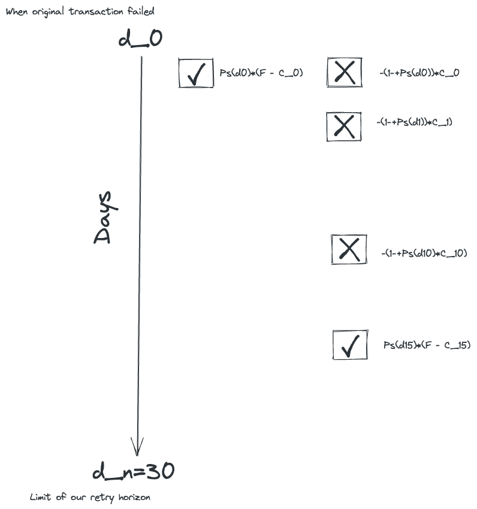
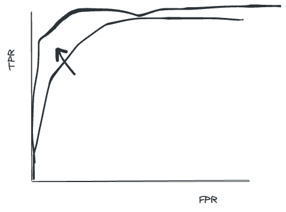
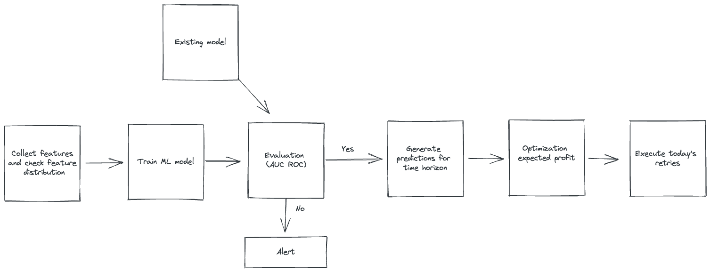

# Stripe Payment Retry

This case is based on [this video](https://www.youtube.com/watch?v=uCiBkaA4V6M) from Exponent.

- Problem: Figure out a more efficient policy for retrying for payments that were declined.
- What is the business goal?
    - Improve retries - there is a cost associated with retries
    - Want to maximize approval rates under a limited number of retries
    - There is a fee paid to Stripe when you get a successful retry
    - Currently a heuristic where they retry each day
- Structure
    - Define the metric
    - Define your approach
    - Define variables you can collect
    - Define the model
    - Define a way to test the model
    - Think about how to put in production
- Define formally the metric
    - Want to reduce the total cost of retries, but measuring this will conflate growth/contraction in number of transactions
    - Also want to take into account the fee you’ll get at the end - could this be variable between transactions?
    - Metric: Average profit per failed transaction
        - This is something we can track over time and see if our interventions move the needle
- Define approach
    - We want to maximize the expected profit of a failed transaction. We could think of this sort of like a reinforcement learning problem, but we’ll solve it using techniques with better existing tooling.
    
        
    
    - Define variables
        - $d_i$ where $i$  is the number of days since original transaction failed (and goes up to $n$ being the retry horizon)
        - $\{ \mathcal D  \in \mathbb N \vert d_0, d_1, \dots, d_n \}$ is the subset of days we select to retry
        - $P_s(d_i)$ - probability of retry success on day $d_i$
        - $F$ is the fee Stripe charges for a successful transaction
        - $C_i$ is the cost of a retry on day $d_i$
        - $R$ is the net profit for a failed transaction (can be negative if total costs greater than fee)
    - We want to maximize expected profit (i.e., $\max_{\mathcal D} \mathbb E[R]$). This first term sums over all the cases where we could successfully retry and the second term considers the case where none of our retries are successful.
    
    $$
    \mathbb E[R]=  \sum_{d_k \in \mathcal D} \biggl[ P_s(d_k)(F-C_k)-  \sum_{\mathcal D'}(1-P_s(d_i))C_i  \biggr] -\sum_{d_i \in\mathcal D }(1-P_s(d_i))C_i
    $$
    
    $$
     \{ d_i \in \mathcal D', d_k \in \mathcal D \vert d_i < d_k \}
    $$
    
    - Solve using integer linear programming (e.g., PuLP in python) for each failed transaction and solely act on any retries scheduled for today. Re-optimize every day.
        - You would use a binary variable to represent if a day is active, and multiply by that variable for every time a day comes up in the objective. That way you only sum over the active dates
    - To find the probabilities, build a binary classification model
        - Input: Transactions features,  retry day, etc.
        - Output: Whether or not the retry successful
        - Use the probabilities from the model
- Define the features you can collect
    - Transactions features
        - Type of card
        - Amount transaction
        - time of day
        - Location
        - Subscription? One-off payment?
    - Payee features
        - Transaction history
        - Previous declines -
    - Business features
        - Number of declines this business had in the same day as decline
    - Day number of retry
- Machine learning model
    - Models: Logistic regression, Tree-based models like random forests, xgboost
    - Evaluation
        - Split: Time split
        - Metric: AUC ROC - area under curve of the reciever operating curve
        
            
        
    - We could also measure how well this improves average profit per transaction historically
- Strategy for production
    - Automated pipeline run daily
    
        
    
    - Monitoring - build dashboard with average profit per transaction, model metrics (e.g., AUC ROC)
- How to improve
    - Consider a more rigorous formulation as a multi-armed bandit or reinforcement learning problem. This could potentially better treat uncertainty in the model.
    - Maybe look at [Facebook ReAgent](https://github.com/facebookresearch/ReAgent)
